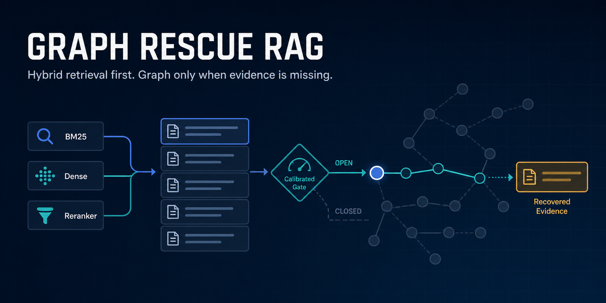
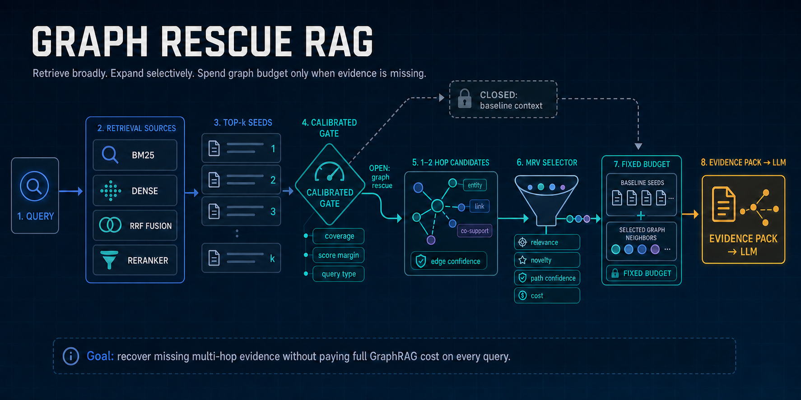

# Graph Rescue RAG

[Русская версия](README_RU.md)



Research code and frozen experimental artifacts for **selective graph rescue
after hybrid retrieval**.

The method first retrieves a compact seed set with BM25, dense retrieval,
reciprocal-rank fusion, and feature reranking. It then explores only the local
passage/entity graph around those seeds. Two learned components control this
step:

- **Marginal Rescue Value (MRV)** ranks a graph candidate by its expected
  contribution given the evidence already retrieved, rather than by query
  similarity alone.
- **Graph Rescuability Gate (GRG)** predicts whether expansion should start or
  continue, allowing the system to skip graph work on queries unlikely to
  benefit.

The final context uses the same passage and token budget as the flat baseline.
This repository is a research artifact, not a claim of leaderboard or SOTA
performance.

## How the method works



The graph is a conditional repair stage, not a replacement for conventional
retrieval:

1. BM25 and dense retrieval produce complementary rankings; RRF and a
   feature reranker form the top-\(k\) seed passages.
2. A calibrated gate estimates whether the current context is likely to miss
   part of the supporting chain. If the gate is closed, the system returns the
   unchanged hybrid context.
3. If the gate opens, the system explores only a bounded 1–3 hop neighborhood
   around the seeds. Candidate paths retain edge provenance and confidence.
4. MRV ranks candidates conditionally on the current evidence using relevance,
   novelty, path confidence, redundancy, and cost features.
5. Selected graph neighbors replace lower-value passages under the same
   passage and token budget; the resulting evidence pack is passed to the
   reader.

## What was run

All primary runs used local Ollama on a Windows laptop with an NVIDIA RTX 4070
Laptop GPU (8 GB VRAM). Quality is the primary endpoint. The recorded latency
traces support comparisons among matched variants inside this implementation,
but are not presented as a hardware-normalized comparison with external
GraphRAG systems.

| Component | Frozen setting |
|---|---|
| Datasets | HotpotQA, 2WikiMultiHopQA, MuSiQue |
| Split size | 1,000 train + 1,000 disjoint evaluation questions per dataset |
| Primary embeddings | `qwen3-embedding:0.6b` through Ollama |
| Sensitivity embeddings | `bge-m3:latest`, one seed |
| Reader | fixed local `qwen3:8b`, identical prompt/decoding for both contexts |
| Training seeds | 101, 202, 303 |
| Graph-corruption seeds | 101, 202, 303, 404, 505 |
| Hybrid retrieval | BM25 + dense + RRF + feature reranker |
| Initial/final context | 2 seeds; 5 passages for Hotpot/2Wiki, 7 for MuSiQue |
| Evidence budget | 1,800 tokens for Hotpot/2Wiki; 2,400 for MuSiQue |
| Graph budget | at most 2 actions and 2 hops; MuSiQue: 3 actions and 3 hops |
| Inference | 5,000 paired bootstrap samples; Holm correction for reader families |

## Comparison under the same retrieval budget

The frozen protocol uses 1,000 training and 1,000 disjoint evaluation questions
per dataset. Values below are full-evidence rates for the primary
`qwen3-embedding:0.6b`, seed 101 run.

| Dataset | Hybrid | KG²RAG-style control | Gated MRV | Gated − Hybrid | 95% paired bootstrap CI |
|---|---:|---:|---:|---:|---:|
| HotpotQA | 0.640 | 0.743 | **0.810** | +0.170 | [0.143, 0.197] |
| 2WikiMultiHopQA | 0.367 | 0.494 | **0.572** | +0.205 | [0.178, 0.231] |
| MuSiQue | 0.156 | 0.202 | **0.252** | +0.096 | [0.074, 0.118] |

The KG²RAG-style control is an independent, equal-budget adaptation of the
published semantic-seed → graph-expansion pattern. It is not an exact
reproduction of KG²RAG and uses none of its source code.

The compared systems share the initial hybrid ranking, `seed_k`, `final_k`,
token budget, and graph-action budget:

| System | Graph access | Candidate decision | Role in the comparison |
|---|---|---|---|
| Hybrid | none | flat reranked list | strong non-graph baseline |
| KG²RAG-style control | always-on local expansion | query relevance + propagated seed score + multi-seed support | published-pattern, equal-budget control |
| Graph Rescue / gated MRV | conditional local expansion | calibrated gate + evidence-conditioned marginal value | proposed method |
| Oracle upper bound | gold-aware diagnostic only | best reachable evidence under the budget | headroom estimate, not a deployable baseline |

### Broader frozen transfer

A second protocol freezes the trained method and evaluates every remaining
development query after a 200-query calibration partition. It covers 17,375
unseen queries across substantially larger per-dataset corpora. This is a
global-development transfer test, not a full-Wikipedia or official leaderboard
setting.

| Dataset | Queries | Corpus passages | Hybrid FE | Gated MRV FE | Difference | 95% paired CI |
|---|---:|---:|---:|---:|---:|---:|
| HotpotQA | 5,199 | 74,593 | 0.568 | **0.650** | +0.082 | [0.073, 0.091] |
| 2WikiMultiHopQA | 11,160 | 58,432 | 0.324 | **0.397** | +0.073 | [0.068, 0.078] |
| MuSiQue | 1,016 | 33,439 | 0.206 | **0.322** | +0.116 | [0.094, 0.140] |

The retrieval gain transfers, but the gate's selectivity does not transfer
cleanly. Recalibration on 200 target-domain queries improves rescue recall and
expected calibration error, while often increasing the graph-open rate above
0.89. This is reported as a limitation rather than hidden as a tuning detail.

### Official-code external baseline

The released HippoRAG MuSiQue corpus was evaluated on 1,000 unique query IDs
with a common top-7 evidence metric. StandardRAG and HippoRAG use the official
HippoRAG repository; its local Qwen3 recognition-memory call runs through the
Ollama OpenAI-compatible endpoint with reasoning disabled. Graph Rescue uses
the same 11,656 released passages through a separately validated adapter.

| System | FE@7 | Support recall@7 | Median retrieval ms | p95 ms |
|---|---:|---:|---:|---:|
| StandardRAG, official code | 0.227 | 0.580 | 149.2 | 212.0 |
| HippoRAG, official code | 0.269 | 0.605 | 3,727.5 | 5,171.2 |
| Graph Rescue shared hybrid | 0.229 | 0.571 | 37.5 | 57.4 |
| Graph Rescue gated MRV | **0.366** | **0.643** | 103.3 | 145.9 |

The paired FE@7 difference between gated MRV and official HippoRAG is +0.097
(95% CI [0.071, 0.125]). The external gate opens on 99.8% of these queries, so
this run supports the retrieval-quality claim but not a cross-system
selectivity claim. Latencies are implementation-specific and are not treated
as hardware-normalized speed rankings.

### Clean latency of the gate

The efficiency question is isolated in a repeated benchmark: 200 queries per
dataset, three repetitions, warmed models, and paired per-query means. Relative
to the same MRV policy with graph expansion always enabled, the gate saves
graph actions and 6.5--12.0 ms of mean online retrieval time.

| Dataset | Hybrid p50 ms | Always-MRV p50 ms | Gated-MRV p50 ms | Gated p95 ms | Mean gated − always ms (95% CI) | Actions always → gated |
|---|---:|---:|---:|---:|---:|---:|
| HotpotQA | 179.1 | 212.2 | 208.2 | 284.7 | -6.6 [-8.2, -5.0] | 1.95 → 1.58 |
| 2WikiMultiHopQA | 178.1 | 220.8 | 201.6 | 265.1 | -12.0 [-15.1, -9.1] | 1.97 → 1.50 |
| MuSiQue | 220.1 | 288.5 | 282.8 | 363.5 | -6.5 [-8.9, -4.3] | 3.00 → 2.77 |

These measurements exclude offline graph/index construction and answer
generation. They show a modest saving versus always-on MRV inside this system;
they do not establish that Graph Rescue is faster than a complete external
GraphRAG lifecycle. Machine-readable source values and provenance are in
[`outputs/extended_validation_v1/`](outputs/extended_validation_v1/).

### Downstream reader results

The same local Qwen3-8B reader was evaluated on both contexts for all 1,000
evaluation questions per dataset.

| Dataset | Hybrid Answer F1 | Graph Rescue Answer F1 | Δ | 95% paired CI | Holm-adjusted p |
|---|---:|---:|---:|---:|---:|
| HotpotQA | 0.423 | **0.465** | +0.042 | [0.020, 0.064] | 0.0024 |
| 2WikiMultiHopQA | 0.232 | **0.307** | +0.075 | [0.054, 0.097] | <0.0002 |
| MuSiQue | 0.133 | 0.151 | +0.018 | [0.001, 0.036] | 0.126 |

The direction of the gated-MRV effect is stable across three training seeds and
with BGE-M3 embeddings. Robustness tests show that false graph edges are more
damaging than missing edges. On the full 1,000-query evaluation split, a fixed
local Qwen3-8B reader improves Answer F1 by +0.042 on HotpotQA and +0.075 on
2WikiMultiHopQA. The +0.018 MuSiQue change is positive but does not remain
significant after Holm correction. These downstream results are resource-bounded
diagnostics and are separate from the frozen retrieval claim.

## Install and smoke test

Requirements:

- Python 3.10 or newer;
- a running [Ollama](https://ollama.com/) service;
- `qwen3-embedding:0.6b` for the default demo.

```powershell
python -m venv .venv
.\.venv\Scripts\Activate.ps1
python -m pip install -e .
ollama pull qwen3-embedding:0.6b
python -m graph_rescue doctor --config examples/demo_config.json
python -m graph_rescue run --config examples/demo_config.json
```

Run the test suite:

```powershell
python -m unittest discover -s tests -v
```

The hashing fallback exists only for unit and smoke tests. It must not be used
for article results.

## Reproduce the research protocol

The repository intentionally excludes benchmark data, model caches, generated
corpora, and per-query reader generations. See:

- [DATA.md](DATA.md) for data sources, local paths, checksums, and licensing;
- [REPRODUCING.md](REPRODUCING.md) for the staged experiment commands;
- [docs/baseline_search_log.md](docs/baseline_search_log.md) for the
  comparison/code-availability audit and current novelty boundary;
- [docs/russian_manuscript_plan.md](docs/russian_manuscript_plan.md) for the
  Russian-language manuscript outline;
- [docs/habr_announcement_plan_ru.md](docs/habr_announcement_plan_ru.md) for a
  non-hype Russian technical launch post focused on reproduction;
- [outputs/REPRODUCIBILITY_MANIFEST.md](outputs/REPRODUCIBILITY_MANIFEST.md)
  for frozen protocol identifiers;
- [outputs/FINAL_EXPERIMENT_REPORT_RU.md](outputs/FINAL_EXPERIMENT_REPORT_RU.md)
  for the detailed Russian-language report.
- [outputs/PUBLICATION_AND_GITHUB_STRATEGY_RU_v2.md](outputs/PUBLICATION_AND_GITHUB_STRATEGY_RU_v2.md)
  for the JIIS submission route and GitHub dissemination plan.

Compact analysis tables and figures are included under
`outputs/final_v1/analysis/`. Full manuscript drafts are intentionally kept out
of the first public snapshot until the selected venue confirms its
preprint/public-repository policy.

## Repository layout

```text
graph_rescue/                  core package
tests/                         unit and integration tests
examples/                      demo and frozen experiment configs
work/*.py                      preparation, execution, and analysis entry points
outputs/final_v1/analysis/     compact aggregate results
outputs/published_baselines/   equal-budget published-pattern comparison
outputs/extended_validation_v1/ portable global, official-code, and latency summary
```

## Limits and responsible reporting

- The evaluation uses frozen pooled-corpus protocols derived from benchmark
  questions; it is not the official open-domain leaderboard setting.
- Retrieval full-evidence is the primary endpoint. Reader results are a
  downstream validation, not a substitute for stronger-model evaluation.
- The graph is source-grounded and constructed without gold supporting-fact
  labels, but the protocol remains benchmark-specific.
- Retrieval gains transfer to broader corpora, but gate selectivity can fail
  under domain/protocol shift; target recalibration often opens the graph for
  most queries.
- Hardware-normalized construction cost and independent reproduction remain
  desirable before a strong archival claim.

## License and citation

Project-authored code is released under Apache-2.0; see [LICENSE](LICENSE) and
[NOTICE](NOTICE). Dataset text and third-party evaluation code remain under
their original terms and are not relicensed here.

The release metadata in [CITATION.cff](CITATION.cff) identifies Maksim Odintsov
as the project author.
